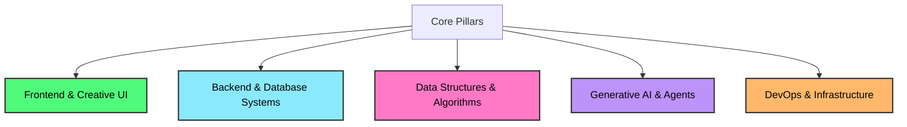

# 🚀 Zero to Fullstack

Welcome to my **Zero to Fullstack** engineering repository! This is my personal learning log, implementation playground, and project portfolio. 

Rather than just learning syntax, my focus is on **Product Engineering**—building production-ready, highly interactive, and AI-powered web applications from scratch. This path is guided by core pillars of modern software engineering: Frontend & Creative UI, Backend Systems, Data Structures & Algorithms, and AI Integration.

---

## 🛠️ Core Learning Pillars

My roadmap is built around five core disciplines to transition from a novice developer to a startup-ready software engineer:



---

## 📅 Roadmap & Milestones

### 🎨 Pillar 1: Frontend Engineering & Creative UI (In Progress)
- [x] **HTML5 Semantic & Core Markup:** Structuring clean, accessible web layouts.
- [ ] **CSS3 & Responsive Design:** Mastering Box Model, Flexbox, Grid, and Media Queries.
- [ ] **Creative Frontend & Animations:** Integrating interactive motion design using libraries like GSAP and ScrollTrigger.
- [ ] **Modern JavaScript (ES6+):** Deep-dive into DOM manipulation, Event loop, Async/Await, and Web APIs.
- [ ] **Component-Driven UI (React.js):** Building scalable interfaces, state management, and custom hooks.

### ⚙️ Pillar 2: Backend Systems & Databases
- [ ] **Server Architecture:** Building RESTful and GraphQL APIs with Node.js and Express.js.
- [ ] **Database Engineering:** Modeling data with relational (PostgreSQL) and non-relational (MongoDB/Redis) databases.
- [ ] **Security & Real-time Web:** Custom authentication (JWT, OAuth, OTPs) and bidirectional communication via WebSockets.

### 🧠 Pillar 3: Data Structures & Algorithms (DSA)
- [ ] **DSA in JavaScript:** Structuring solutions to complex algorithmic problems.
- [ ] **Core Structures:** Linked Lists, Stacks, Queues, Trees, Hashing, and Graphs.
- [ ] **Algorithmic Patterns:** Sorting/Searching, Recursion, Two-Pointers, and Dynamic Programming.

### 🤖 Pillar 4: Generative AI & AI Engineering
- [ ] **AI-Powered Applications:** Connecting to LLM APIs (OpenAI, Gemini) and engineering custom system instructions.
- [ ] **Retrieval-Augmented Generation (RAG):** Constructing semantic searches using Vector Databases.
- [ ] **AI Agents:** Implementing tool usage and autonomous loops using frameworks like LangChain.

### 🌐 Pillar 5: DevOps & Infrastructure
- [ ] **Containerization:** Packaging apps with Docker for environment consistency.
- [ ] **Deployment & Pipelines:** Creating automated CI/CD pipelines and deploying to cloud infrastructure (AWS/Vercel/Render).

---

## 📖 Daily Execution Log

### 💡 Day 1: Semantic Markup & Native HTML Capabilities
* **Core Goal:** Master standard text formatting elements, focus on web accessibility (a11y) and built-in HTML tag capabilities.
* **Topics & Tags Covered:**
  * **Emphasis & Hierarchy:** `<strong>`, `<em>`, `<small>`
  * **Markup Utility:** Highlights (`<mark>`), abbreviations with tooltips (`<abbr>`), line break rules (`<wbr>`)
  * **Technical Text Representation:** Code elements (`<code>`), terminal output simulator (`<samp>`), variables (`<var>`), keyboard shortcut formats (`<kbd>`)
  * **Metadata & Citations:** Quotations (`<q>`), sources (`<cite>`), machine-readable dates/times (`<time>`)
* **Playground File:** [frontend/HTML/index.html](file:///d:/Web%20dev/frontend/HTML/index.html)

### 💡 Day 2: HTML Tables & Forms
* **Core Goal:** Learn how to present structured tabular data and handle user input through form controls.
* **Topics & Tags Covered:**
  * **Tabular Data:** `<table>`, `<caption>`, `<thead>`, `<tbody>`, `<tfoot>`, rows (`<tr>`), header cells (`<th>`), data cells (`<td>`), scopes (`scope="row"`)
  * **User Inputs & Forms:** `<form>`, text fields (`<input type="text">`), labels (`<label>`), options/choices (`<input type="radio">`, `<input type="checkbox">`), and form submission (`<input type="submit">`)
* **Playground Files:**
  * [frontend/HTML/index.html](file:///d:/Web%20dev/frontend/HTML/index.html) (Tables)
  * [frontend/HTML/form.html](file:///d:/Web%20dev/frontend/HTML/form.html) (Forms)

---

## 📂 Project Showcase

As I advance through the pillars, key capstone projects will be documented and linked here.

| Project Name | Stack | Description | Status |
| :--- | :--- | :--- | :--- |
| **HTML Playground** | HTML5, CSS3 | A collection of basic and advanced HTML tag implementations. | `Completed` |
| **Interactive UI Sandbox** | GSAP, React | Richly animated creative landing pages showcasing smooth scrolling. | `Planned` |
| **AI Companion** | Node, Express, LLM API | Fullstack AI chatbot utilizing vector database context injection (RAG). | `Planned` |

---

## 🚀 How to Run Locally

1. Clone this repository:
   ```bash
   git clone https://github.com/S4SahilXO/Zero-to-Fullstack.git
   ```
2. Navigate into the frontend directory:
   ```bash
   cd Zero-to-Fullstack/frontend
   ```
3. Open `index.html` in your favorite web browser or start a local live server.

---
*“Coding is not just about writing lines of code; it is about building products that solve real-world problems.”* Let's create! 💻
